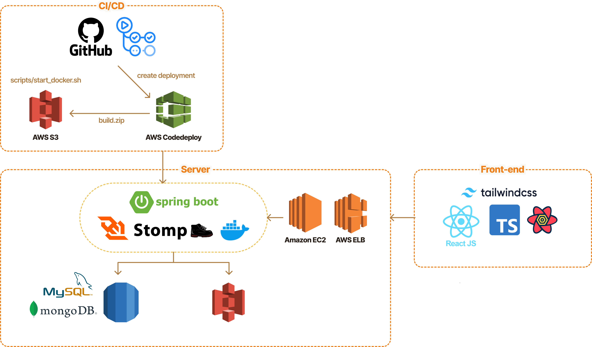

   
  

## 목차

1. [**웹 서비스 소개**](#1)
2. [**서비스 아키텍쳐**](#2)
3. [**주요 기능**](#3)
4. [**개발팀 소개**](#4)
    

## 💁 웹 서비스 소개

**플렛지(Fledge)** 는 자립준비청년들이 안전하고 투명한 지원을 통해 자신의 꿈을 이룰 수 있도록 후원자와 멘토가 함께하는 신뢰의 네트워크를 통해 청년들의 지속 가능한 자립을 지원하는 서비스입니다.

## 📂 서비스 아키텍처

## ✅ 주요 기능

| 웹 화면                                                                                                   | 기능                                                                                                                                                                                                                                                                                                                                    |
| --------------------------------------------------------------------------------------------------------- | --------------------------------------------------------------------------------------------------------------------------------------------------------------------------------------------------------------------------------------------------------------------------------------------------------------------------------------- |
|  | **메인페이지**  메인 페이지 fledge의 후원하기, 멘토링, 챌린지, 소개 모든 기능을 한 눈에 확인할 수 있습니다.                                                                                                                                                                                                                         |
|  | **로그인/회원가입 및 자립준비청년 인증**  카카오 소셜 로그인을 통해 간편하게 로그인할 수 있습니다. 마이페이지 접속 시, 자립준비청년 인증 버튼을 클릭하고 보호종료청년 증빙과 함께 정보를 입력하여 자립준비청년 인증을 진행합니다. 인증이 완료되면, 자립준비청년으로써 후원글을 작성하고 챌린지, 멘토링에 참여할 수 있습니다.        |
|  | **후원글 등록**  자립 준비 청년이 필요한 물품과 구입 링크, 가격, 이유를 포함한 후원 요청 글을 작성합니다. 개인정보(주소, 휴대폰 번호, 이름 등)와 후원 인증 방식을 선택할 수 있습니다.                                                                                                                                               |
|   | **후원하기**  후원자는 후원글의 내용을 확인하고 자립준비청년의 프로필을 확인할 수 있으며, 후원 실패 시 반환 받을 환불 계좌 정보를 입력할 수 있습니다.                                                                                                                                                                               |
|   | **챌린지 조회 및 참여**  정부나 기업, 관련 기관 등에서 지원하는 프로그램 참여, 자격증 공부, 일상 회복 및 적응 관련 챌린지 리스트를 확인하고 참여를 원하는 챌린지를 조회할 수 있습니다. 인기 있는 챌린지와 신규 챌린지, 그리고 카테고리별 챌린지를 추천해주며, 참여하고 싶은챌린지를 검색하고, 관심있는 챌린지에 참여할 수 있습니다. |

## 👨‍👩‍👧‍👦 개발 팀 소개

**김가경**  
👀GitHub: [@gaguriee](https://github.com/gaguriee)  

**이주승**  
👀GitHub: [@JuseungL](https://github.com/JuseungL)
